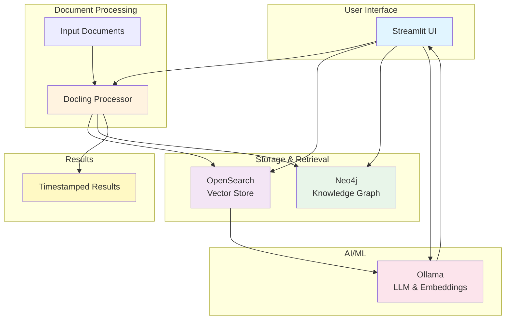

# OpenSearch-Docling-GraphRAG

A comprehensive document processing and Retrieval-Augmented Generation (RAG) system that combines advanced document parsing, vector search, and knowledge graph capabilities.

## 🌟 Features

- **📄 Advanced Document Processing**: Process various document formats (PDF, DOCX, PPTX, HTML, Markdown) using Docling
- **🔍 Vector Search**: Semantic search powered by OpenSearch with embedding-based retrieval
- **🕸️ Knowledge Graph**: Build and explore knowledge graphs using Neo4j
- **💬 RAG Question Answering**: Context-aware responses using local LLMs via Ollama
- **📊 Batch Processing**: Process multiple documents efficiently
- **🎨 Modern UI**: User-friendly Streamlit interface
- **🐳 Containerized**: Docker and Kubernetes ready
- **⚡ Background Job Queue**: Async document processing with progress tracking
- **⏱️ Timestamped Outputs**: All results saved with timestamps

## 🏗️ Architecture



## 📋 Prerequisites

- **Python 3.11, 3.12, or 3.13** (Python 3.14+ not yet supported by dependencies)
- Docker & Docker Compose
- Ollama with models installed:
  - `ibm/granite4:latest` (or your preferred LLM)
  - `granite-embedding:278m` (or alternative embedding model)
- 8GB+ RAM
- 10GB+ disk space

## 🚀 Quick Start

### 1. Clone the Repository

```bash
git clone <your-repo-url>
cd opensearch-docling-graphrag
```

### 2. Configure Environment

```bash
cp .env.example .env
# Edit .env with your configuration
```

### 3. Start the Application

```bash
./start.sh
```

The script will:
- Create necessary directories
- Set up Python virtual environment
- Install dependencies
- Start Docker services (OpenSearch, Neo4j)
- Launch the Streamlit application

Access the application at: **http://localhost:8501**

### 4. Stop the Application

```bash
./stop.sh
```

## 📖 Usage

### Upload Single Document

1. Navigate to the "Upload" tab
2. Select a document file
3. Click "Process Document"
4. View results and explore the knowledge graph

### Batch Processing

1. Place documents in the `./input` directory
2. Navigate to "Batch Process" tab
3. Click "Process All Files"
4. Results saved to `./output` with timestamps

### Search & Query

1. Navigate to "Search" tab
2. Enter your question
3. View AI-generated answer with sources
4. Explore related documents

### Knowledge Graph

1. Navigate to "Graph Explorer" tab
2. View graph statistics
3. Search for entity connections
4. Explore document relationships

## 🏗️ Project Structure

```
opensearch-docling-graphrag/
├── app.py                      # Main Streamlit application
├── requirements.txt            # Python dependencies
├── .env.example               # Environment configuration template
├── start.sh                   # Application startup script
├── stop.sh                    # Application shutdown script
├── github-deploy.sh           # GitHub deployment automation
├── Dockerfile                 # Application container
├── docker-compose.yml         # Multi-service orchestration
│
├── config/                    # Configuration modules
│   ├── __init__.py
│   └── settings.py           # Application settings
│
├── src/                      # Source code
│   ├── processors/           # Document processing
│   │   ├── __init__.py
│   │   └── docling_processor.py
│   │
│   ├── rag/                  # RAG components
│   │   ├── __init__.py
│   │   ├── opensearch_client.py
│   │   └── ollama_client.py
│   │
│   ├── graphrag/             # Knowledge graph
│   │   ├── __init__.py
│   │   ├── neo4j_client.py
│   │   └── graph_builder.py
│   │
│   └── ui/                   # UI components
│       └── __init__.py
│
├── k8s/                      # Kubernetes manifests
│   ├── README.md
│   ├── namespace.yaml
│   ├── configmap.yaml
│   ├── secrets.yaml
│   ├── opensearch-deployment.yaml
│   ├── neo4j-deployment.yaml
│   └── app-deployment.yaml
│
├── docs/                     # Documentation
├── input/                    # Input documents directory
├── output/                   # Processed results (timestamped)
└── logs/                     # Application logs
```

## 🐳 Docker Deployment

### Using Docker Compose

```bash
# Start all services
docker-compose up -d

# View logs
docker-compose logs -f

# Stop services
docker-compose down
```

### Build Custom Image

```bash
docker build -t docling-rag:latest .
docker run -p 8501:8501 docling-rag:latest
```

## ☸️ Kubernetes Deployment

See [k8s/README.md](k8s/README.md) for detailed Kubernetes deployment instructions.

Quick deploy:

```bash
kubectl apply -f k8s/namespace.yaml
kubectl apply -f k8s/configmap.yaml
kubectl apply -f k8s/secrets.yaml
kubectl apply -f k8s/opensearch-deployment.yaml
kubectl apply -f k8s/neo4j-deployment.yaml
kubectl apply -f k8s/app-deployment.yaml
```

## 🔧 Configuration

### Environment Variables

Key configuration options in `.env`:

```bash
# Ollama
OLLAMA_BASE_URL=http://localhost:11434
OLLAMA_MODEL=ibm/granite4:latest
OLLAMA_EMBEDDING_MODEL=granite-embedding:278m

# OpenSearch
OPENSEARCH_HOST=localhost
OPENSEARCH_PORT=9200
OPENSEARCH_USER=admin
OPENSEARCH_PASSWORD=admin

# Neo4j
NEO4J_URI=bolt://localhost:7687
NEO4J_USER=neo4j
NEO4J_PASSWORD=password

# Processing
CHUNK_SIZE=512
CHUNK_OVERLAP=50
```

## 📊 System Requirements

### Minimum

- CPU: 4 cores
- RAM: 8GB
- Storage: 10GB

### Recommended

- CPU: 8+ cores
- RAM: 16GB+
- Storage: 50GB+
- GPU: Optional (for faster embeddings)

## 🔍 Supported Document Formats

- PDF (`.pdf`)
- Microsoft Word (`.docx`)
- Microsoft PowerPoint (`.pptx`)
- HTML (`.html`)
- Markdown (`.md`)
- Plain Text (`.txt`)
- AsciiDoc (`.adoc`)
- Images (with OCR)

## 🛠️ Development

### Setup Development Environment

```bash
python -m venv venv
source venv/bin/activate  # On Windows: venv\Scripts\activate
pip install -r requirements.txt
```

### Run Tests

```bash
pytest
```

### Code Style

```bash
# Format code
black .

# Lint
flake8 .
```

## 📝 API Documentation

### Document Processing

```python
from src.processors import DoclingProcessor

processor = DoclingProcessor()
result = processor.process_document("path/to/document.pdf")
```

### Vector Search

```python
from src.rag import OpenSearchClient, OllamaClient

os_client = OpenSearchClient()
ollama_client = OllamaClient()

# Generate embedding
embedding = ollama_client.generate_embedding("query text")

# Search
results = os_client.search(embedding, k=5)
```

### Knowledge Graph

```python
from src.graphrag import Neo4jClient, GraphBuilder

neo4j_client = Neo4jClient()
graph_builder = GraphBuilder(neo4j_client)

# Build graph
graph_builder.build_document_graph(
    document_id="doc1",
    file_name="document.pdf",
    file_path="/path/to/document.pdf",
    chunks=chunks
)
```

## 🤝 Contributing

1. Fork the repository
2. Create a feature branch (`git checkout -b feature/amazing-feature`)
3. Commit your changes (`git commit -m 'Add amazing feature'`)
4. Push to the branch (`git push origin feature/amazing-feature`)
5. Open a Pull Request

## 📄 License

This project is licensed under the MIT License - see the LICENSE file for details.

## 🙏 Acknowledgments

- [Docling](https://github.com/docling-project/docling) - Document processing
- [OpenSearch](https://github.com/opensearch-project/OpenSearch) - Vector search
- [Neo4j](https://github.com/neo4j/neo4j) - Knowledge graph
- [Ollama](https://ollama.ai/) - Local LLM inference
- [Streamlit](https://streamlit.io/) - Web UI framework

## 📞 Support

For issues, questions, or contributions:
- Open an issue on GitHub
- Check the [documentation](docs/)
- Review [k8s/README.md](k8s/README.md) for deployment help

## 🗺️ Roadmap

- [ ] Multi-language support
- [ ] Advanced entity extraction with NER models
- [ ] Real-time document monitoring
- [ ] API endpoints (REST/GraphQL)
- [ ] Enhanced visualization
- [ ] Performance optimizations
- [ ] Cloud deployment templates (AWS, GCP, Azure)

---

**Built with ❤️ for the AI community**