# Architecture Documentation

## System Overview

The OpenSearch-Docling-GraphRAG system is a comprehensive document processing and retrieval-augmented generation platform that combines multiple technologies to provide advanced document understanding and question-answering capabilities.

## High-Level Architecture

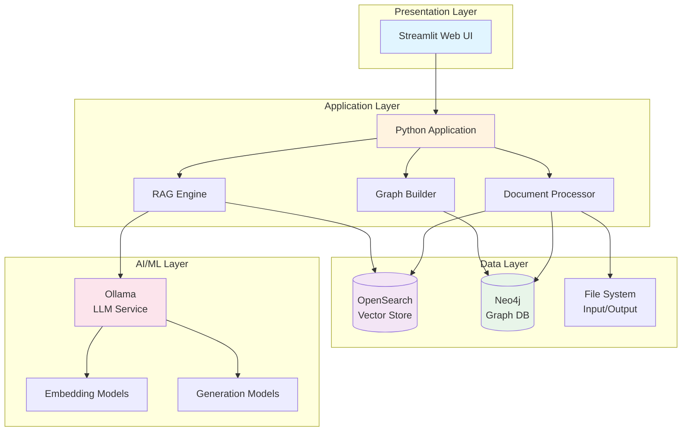

## Component Architecture

### 1. Document Processing Pipeline

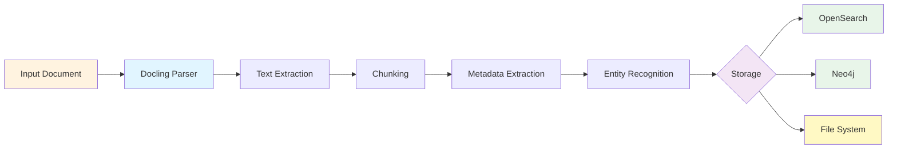

### 2. RAG Query Flow

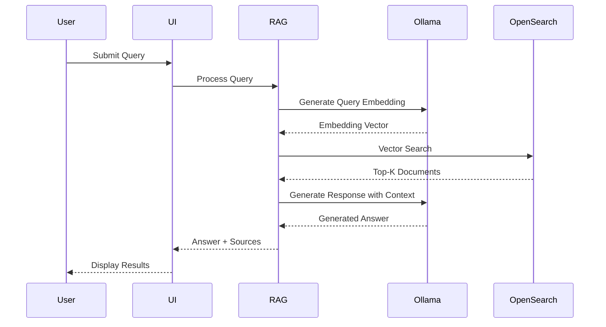

### 3. Knowledge Graph Construction

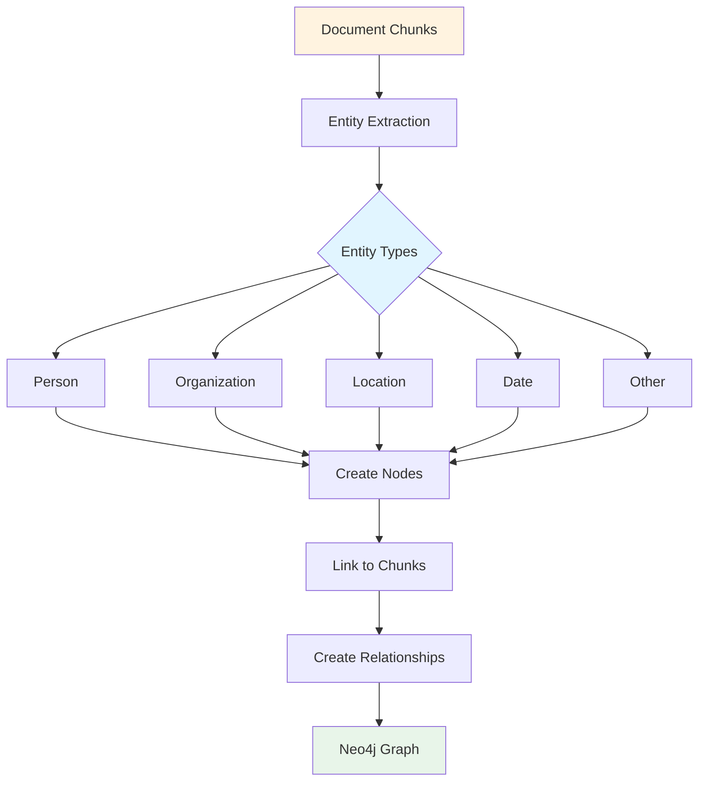

## Data Flow

### Document Ingestion

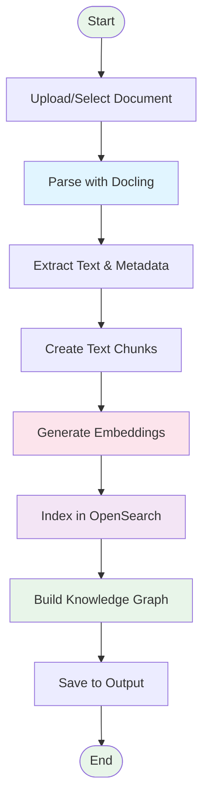

### Query Processing

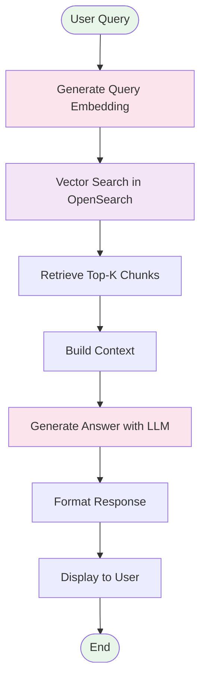

## Technology Stack

### Core Technologies

| Component | Technology | Purpose |
|-----------|-----------|---------|
| Document Processing | Docling | Parse and extract content from various formats |
| Vector Store | OpenSearch | Store and search document embeddings |
| Knowledge Graph | Neo4j | Store and query entity relationships |
| LLM/Embeddings | Ollama | Generate embeddings and responses |
| Web Framework | Streamlit | User interface |
| Language | Python 3.11+ | Application logic |

### Supporting Technologies

| Component | Technology | Purpose |
|-----------|-----------|---------|
| Containerization | Docker | Application packaging |
| Orchestration | Docker Compose | Multi-service management |
| Deployment | Kubernetes | Production deployment |
| Logging | Loguru | Application logging |
| Configuration | Pydantic | Settings management |

## Deployment Architecture

### Docker Compose Deployment

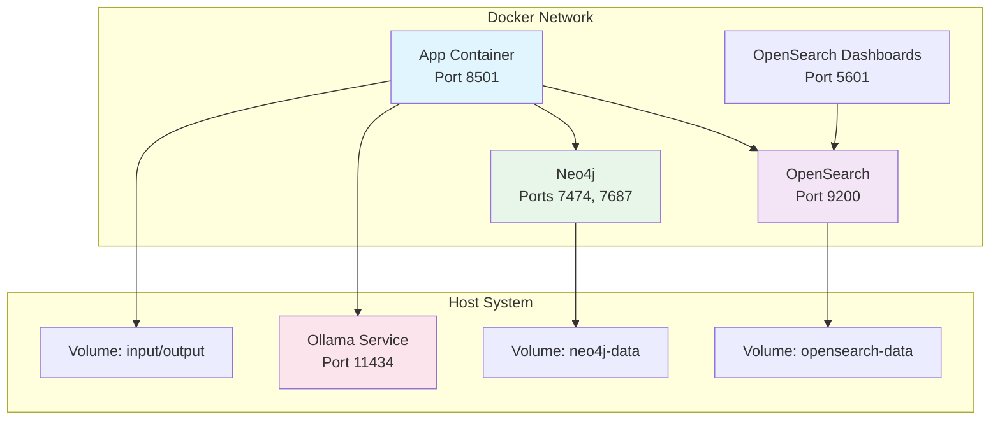

### Kubernetes Deployment

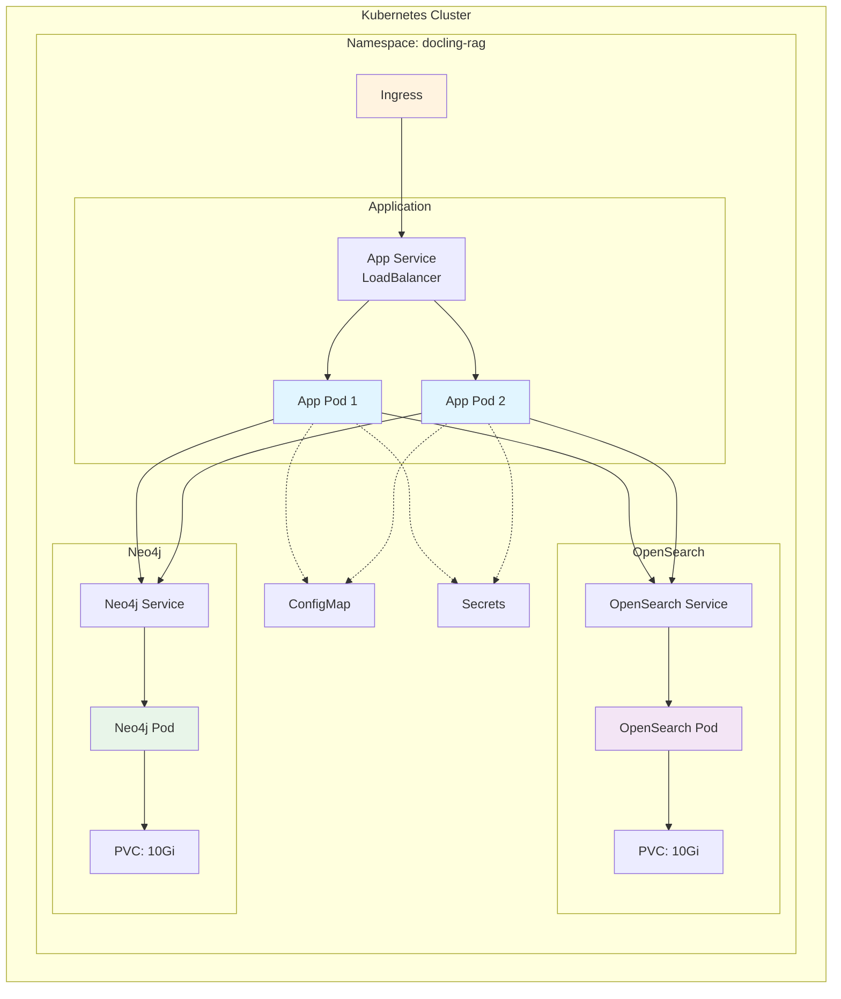

## Security Architecture

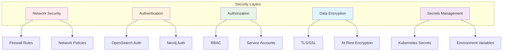

## Scalability Considerations

### Horizontal Scaling

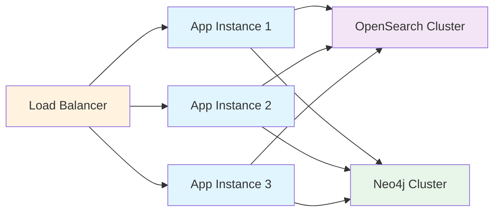

### Performance Optimization

1. **Caching Strategy**
   - Embedding cache for frequently queried texts
   - Document metadata cache
   - Graph query result cache

2. **Batch Processing**
   - Parallel document processing
   - Bulk indexing in OpenSearch
   - Batch graph operations

3. **Resource Management**
   - Connection pooling
   - Memory-efficient chunking
   - Async operations where possible

## Monitoring & Observability

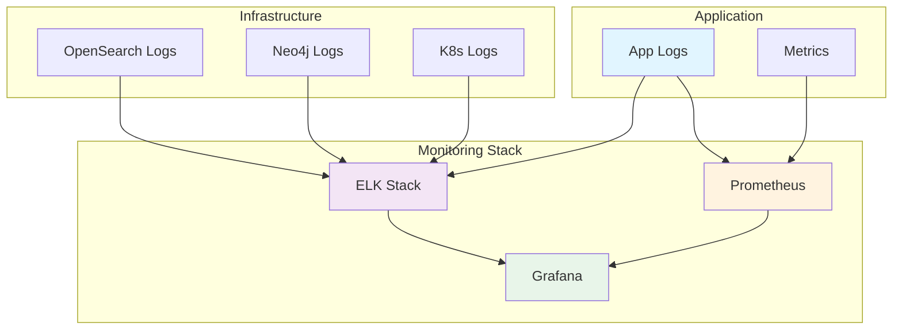

## API Architecture

### REST API

The system provides a comprehensive REST API built with FastAPI:

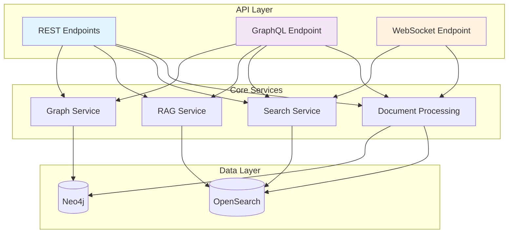

### API Endpoints

**REST API (Port 8000)**
- `POST /api/documents/upload` - Upload and process documents
- `POST /api/documents/batch` - Batch process documents
- `GET /api/documents/batch/{job_id}` - Get batch job status
- `POST /api/search` - Vector search
- `POST /api/rag/query` - RAG question answering
- `GET /api/graph/stats` - Graph statistics
- `POST /api/graph/connections` - Entity connections
- `GET /api/health` - Health check
- `GET /api/config` - System configuration

**GraphQL API (Port 8000)**
- `/api/graphql` - GraphQL endpoint with queries and mutations
- Interactive GraphQL playground available

**WebSocket API (Port 8000)**
- `/api/ws` - Real-time updates for document processing

### GPU Acceleration

The system supports optional GPU acceleration for:
- Document processing with Docling
- Embedding generation
- Large batch operations

Configuration via environment variables:
```bash
GPU_ENABLED=true
GPU_DEVICE_ID=0
GPU_MEMORY_FRACTION=0.8
```

## Future Enhancements

1. **Multi-tenancy Support**
   - Isolated data per tenant
   - Resource quotas
   - Custom configurations

2. **Advanced Analytics**
   - Document similarity analysis
   - Trend detection
   - Usage analytics

3. **Enhanced Security**
   - OAuth2/OIDC integration
   - Fine-grained access control
   - Audit logging

4. **Performance Improvements**
   - Distributed processing
   - Advanced caching strategies
   - Query optimization